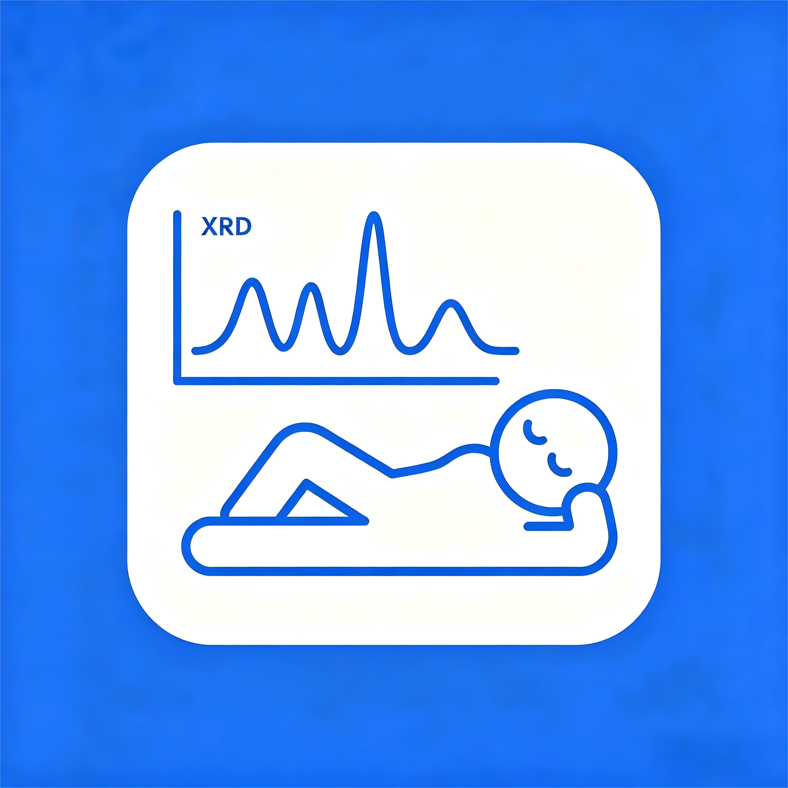

# Relax XRD Plotter

> A free, open-source XRD (X-ray diffraction) plotting tool. · 免费、开源的 XRD 绘图小工具



---

## English

A lightweight XRD plotting tool built for everyday diffraction-data work.
Started learning vibe coding with kimi3 in WorkBuddy. Previously I found making overlay plots
in SigmaPlot / Origin tedious — especially placing symbol markers on peaks.
This tool is designed around my own workflow: simpler to use, easier to tweak.
It's a rough personal project.

### Features
- Drag-and-drop / open to import data with live preview
- Overlay, stacked, and offset plot modes
- Auto / manual peak marking; place symbol + text markers on peaks
- Fine control of axes, titles, legend, border, font (Times New Roman)
- One-click export to PNG / PDF / SVG / TIF (high dpi)
- Chinese / English UI switch (top-right language dropdown, persisted)
- `.xrdproj` project files store the full editing state

### Supported formats
- **Bruker RAW4.00 / D8 exported `.txt`** — auto-detected `[Data]` block, read directly
- Multi-column `.txt` / `.xlsx` — col 1 = 2θ, rest = intensity curves (auto-split)
- Generic `.xy` / `.dat` / `.csv` — comma / tab / semicolon / space auto-detected
- Project file `.xrdproj`

### Requirements
- Python 3.9 or newer
- Python dependencies are listed in `requirements.txt`

### Quick start
**Option A — Portable (recommended, no install)**
Download `Relax XRD Plotter v1.0.zip` from
[Releases](../../releases), unzip, and double-click `Relax XRD Plotter.exe`.

**Option B — Run from source**
```bash
pip install -r requirements.txt
python main.py
```

### Sample data
The repo root includes example files:
- `sample_data.csv` / `sample_data2.csv` — basic examples
- `xrd_multi_column_demo.txt` / `xrd_multi_column_demo.xlsx` — multi-spectrum overlay examples
- `passivated_ball_Pb.txt` — Bruker RAW exported `.txt` example

### Docs & License
- Bilingual quick start: [QuickStart.txt](QuickStart.txt) (中文 / English)
- Full manual (Chinese): [Manual_zh.md](Manual_zh.md)
- Full manual (English): [Manual_en.md](Manual_en.md)
- Installation notes: [Install.txt](Install.txt)
- License: [MIT License](LICENSE)

---

## 中文说明

一款为日常 XRD 数据处理设计的轻量绘图软件。开始学习vibe coding，用 WorkBuddy 中的 kimi3 做的。以前用 SigmaPlot、Origin 做叠图总觉得麻烦，尤其是想在峰上做符号标记时步骤繁琐；这个软件按自己平时的需要设计，操作更简单、调整更方便。这是个粗糙的个人作品。

### 功能特性
- 拖拽 / 打开导入数据，右侧实时预览
- 叠加（overlay）、堆叠（stacked）、偏移（offset）多种绘图模式
- 自动 / 手动标峰，可在峰上放置符号与文字标记
- 坐标轴、标题、图例、边框、字体（Times New Roman）等精细可调
- 一键导出 PNG / PDF / SVG / TIF（高 dpi）
- 中 / 英文界面切换（右上角语言下拉，选择会被记住）
- 工程文件 `.xrdproj` 保存全部编辑状态

### 环境要求
- Python 3.9 及以上
- Python 依赖见 `requirements.txt`

### 安装方法
**方式一：（推荐，免安装）**
到 [Releases](../../releases) 下载 `Relax XRD Plotter v1.0.zip`，解压后双击
`Relax XRD Plotter.exe` 即可使用。

**方式二：从源码运行**
```bash
pip install -r requirements.txt
python main.py
```

详细说明见 [QuickStart.txt](QuickStart.txt)（中英文速览）、
[Manual_zh.md](Manual_zh.md)（中文完整）、[Manual_en.md](Manual_en.md)（English）。

### 许可证
[MIT License](LICENSE)
